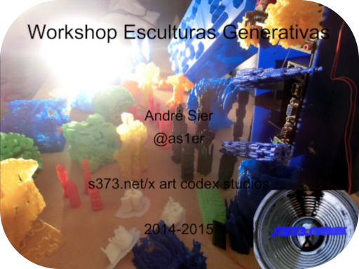
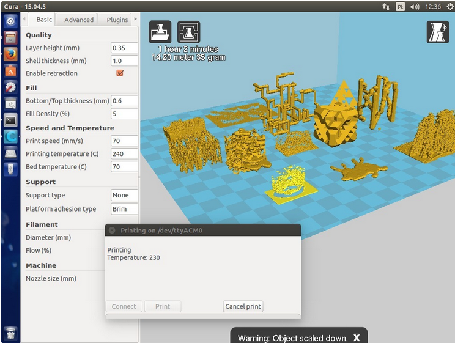
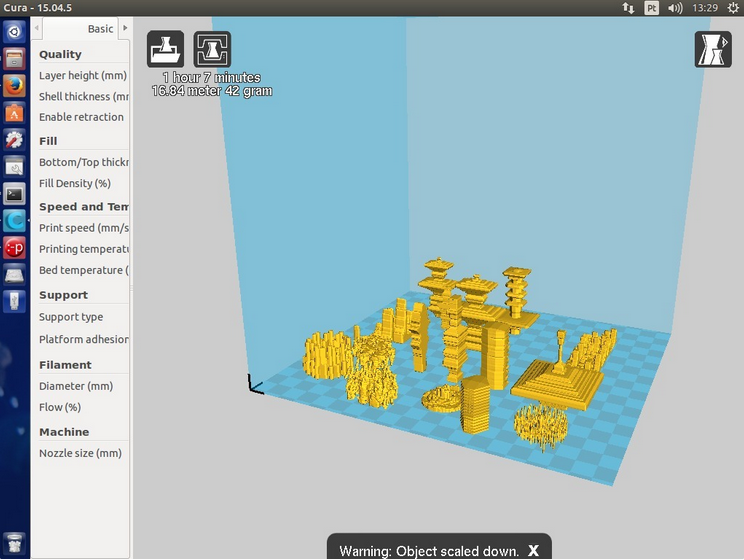
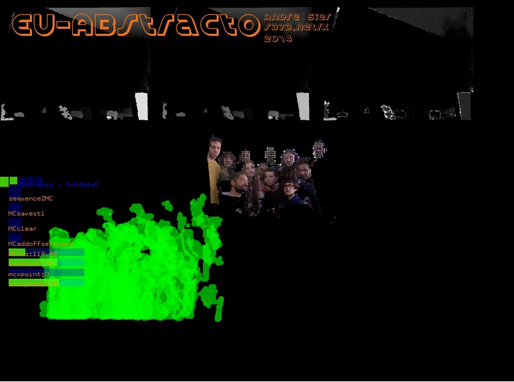
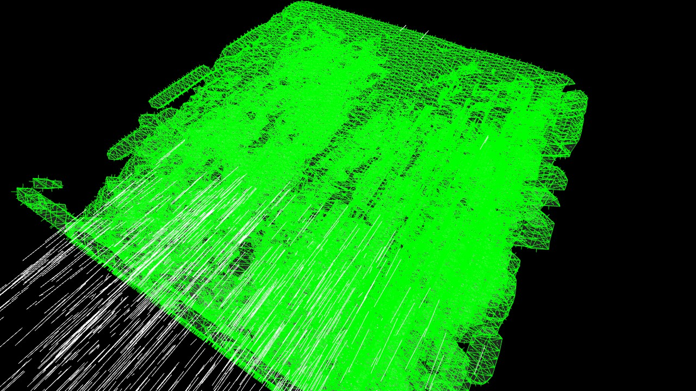

## Esculturas Generativas
## Workshop de Modelação e Fabricação 3D
### Introdução
Modelação e fabricação de Esculturas Generativas através de programas criados em ambientes open-source (Processing e openFrameworks) com bibliotecas de código s373.net/x. Neste módulo vamos gerar esculturas abstractas dos participantes bem como modelar, criar e imprimir formas volumétricas a partir de sons, de câmaras, sensores, algoritmos generativos. O módulo introduz o espaço volumétrico abstracto (voxels), conceitos introdutórios de criação de sólidos tridimensionais, não requer qualquer experiência de modelação 3D, e fornece vários programas exemplo que geram modelos a partir de gestos ou sequências digitalizadas dos utilizadores, sons, sensores e outros interfaces, processos generativos. Com estes programas vamos criar Esculturas Generativas no espaço volumétrico e imprimi-las numa impressora 3D.

### Objectivos
Conhecimentos de vóxeis e de técnicas de poligonização tridimensionais. Modelação de objectos 3D através de sons, gestos, câmaras, algoritmos generativos.
Gravação e impressão de modelos 3D.

### Programa
Space, the final frontier: o que é o espaço volumétrico abstracto computacional. O que é o Voxel. Exemplos de Técnicas de poligonização tridimensional. Instalação e uso das bibliotecas de código s373.net/x ofxMarchingCubes e s373.marchingcubes para openFrameworks e Processing.
Análise e uso de programas exemplo de Modelação de Volumes Tridimensionais com o som, gestos, sensores, câmaras, algoritmos generativos. Criação de retratos 3D com a aplicação Eu-Abstracto. (http://s373.net/folio/projects/eu-abstracto/)
Gravação de ficheiros .stl.
Limpeza e escala do .stl no Blender e preparação no Cura para a impressão 3d. Impressão 3D de objectos criados pelos participantes.

### Workshops
- 2016 Esculturas Generativas, Convento S. Francisco, Coimbra 
- 2016 Esculturas Generativas, FBAUL, Lisboa 
- 2015 Esculturas Generativas, Zaratan, Lisboa 
- 2015 Esculturas Generativas, DAR, Caldas da Rainha 

### Licensa
- (c) 2014-16 s373.net/x, (c) 2022 ArteCódigo
- MIT

### Imagens

